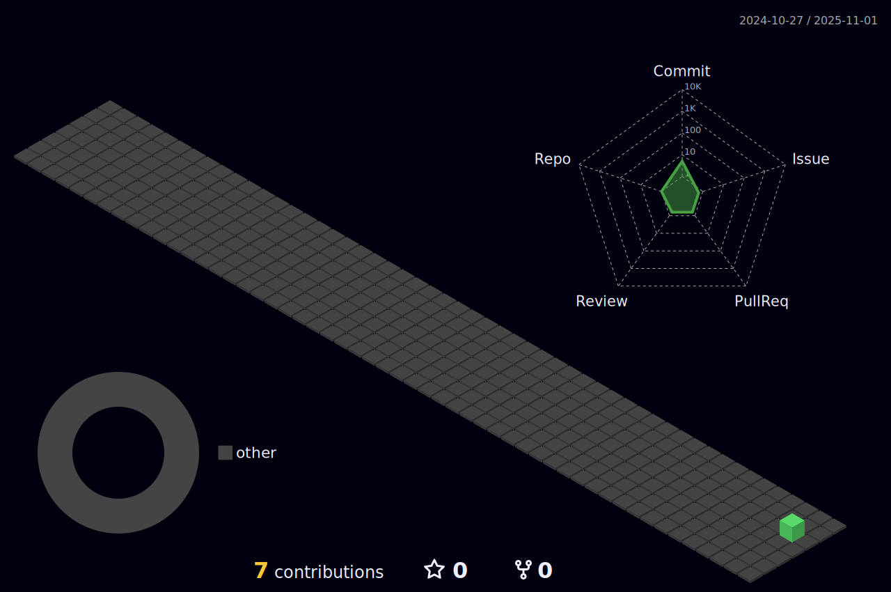

  

---

<h1 align="center">Hey, I'm Sripramod Yogarajan 👋</h1>

  Passionate about Cloud Engineering, Fullstack Development, and DevOps Automation.  
  A technophile with strong focus on building scalable, secure, and real-world solutions.

---

### 🧠 Currently Building Expertise In
- ☁️ Cloud Engineering (AWS, Infrastructure as Code, CI/CD)
- 🧩 Fullstack Development (React, Node.js, MongoDB, Express)
- 🔄 DevOps & Automation (Docker, GitHub Actions, Terraform)

---

  

---

### 🔧 Tech Stack

  
  
  
  
  
  
  
  
  
  
  
  
  
  

---

---

### 🕹️ Contributions

  <picture>
    <source media="(prefers-color-scheme: dark)" srcset="https://raw.githubusercontent.com/Sripramod-Yogarajan/Sripramod-Yogarajan/output/pacman-contribution-graph-dark.svg">
    <source media="(prefers-color-scheme: light)" srcset="https://raw.githubusercontent.com/Sripramod-Yogarajan/Sripramod-Yogarajan/output/pacman-contribution-graph.svg">
    
  </picture>

---

### Leetcode Stats

---

### 📫 Let's Connect
- 🔗 [LinkedIn](https://linkedin.com/in/sripramod)
- 📧 sripramodyogarajan1211@gmail.com

---

  <i>Keep shipping. Keep learning. Keep building.</i>

